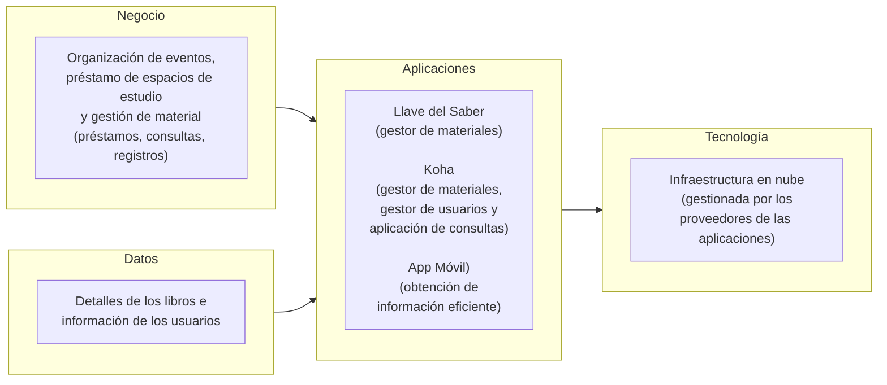

# 📄 Documento de Visión de Arquitectura

## 🔖 Cliente
Biblioteca Pública Municipal Rubiel Valencia Cossio

## 👥 Integrantes del equipo
- Jorge Alarcón (Jorgealis)
- Julian Aguirre (JulianAguirreUnisabana)
- Brayan Presiga (Brayan-137)

## 🗺️ Mapa conceptual de alto nivel

## 🚀 Beneficios esperados

| Objetivo estratégico (Ficha) | Beneficio esperado | Cómo se mide |
|---|---|---|
| Mejorar el servicio de los visitantes y afiliados actuales y futuros | Mejora en la eficiencia del registro de libros, reduciendo el tiempo dedicado a esta tarea | Tiempo promedio invertido en registrar un ejemplar en las plataformas de gestión |
| Promocionar la lectura buscando incrementar la cantidad de visitantes y afiliados | Se facilita e incentiva el acceso de los usuarios a los recursos y servicios de la biblioteca | Número de consultas y préstamos realizados por los usuarios |
| Mejorar el servicio de los visitantes y afiliados actuales y futuros | Disminución de la carga de trabajo del personal de la biblioteca | Cantidad de tareas repetitivas o manuales realizadas por la bibliotecaria |

## 🧭 Alcance

| En alcance | Fuera de alcance |
|---|---|
| Documentación de los procesos tecnológicos actuales y objetivo | Implementación técnica de las soluciones propuestas (solo se entrega el diseño) |
| Integración de una aplicación móvil para el registro rápido de información | Migración de los datos de Llave del Saber a Koha, por restricciones de privacidad de los datos |
| Uso exclusivo de las plataformas exigidas por la gobernación (Llave del Saber y Koha) | Adopción de infraestructura on-premise |

## 💡 Justificación

La Biblioteca Pública Municipal Rubiel Valencia Cossio enfrenta el reto de operar con dos plataformas de gestión de inventario (Llave del Saber y Koha) que deben alimentarse en paralelo con más de 8.000 ejemplares, además de carecer de un canal digital único donde los usuarios puedan consultar eventos e inventario disponible. Esta visión de arquitectura responde directamente a los objetivos estratégicos de promocionar la lectura y mejorar el servicio a los visitantes y afiliados, al ordenar cómo el negocio (préstamos, eventos y gestión de material), los datos (libros y usuarios), las aplicaciones (Llave del Saber y Koha) y la tecnología (infraestructura en nube gestionada por los proveedores) deben articularse para reducir el esfuerzo manual y facilitar el acceso a los recursos.

Al mismo tiempo, la propuesta respeta las restricciones declaradas por la cliente: dado que la bibliotecaria es la única empleada y presenta una condición de salud que le impide realizar tareas repetitivas durante periodos prolongados, el diseño prioriza la reducción de la carga operativa antes que la adición de nuevas herramientas complejas. De igual forma, se respeta la exigencia de la gobernación de utilizar únicamente las plataformas ya asignadas (Llave del Saber y Koha), por lo que no se contempla infraestructura on-premise ni la migración de datos entre ambos sistemas, evitando así riesgos sobre la privacidad de la información.

Finalmente, el alcance del proyecto se limita conscientemente al diseño y documentación de la arquitectura —incluyendo la propuesta de una aplicación móvil que agilice el registro de información—, sin extenderse a la implementación real de las soluciones. Esto es coherente con los recursos limitados, el tiempo disponible y el acceso restringido a las plataformas que enfrenta actualmente la biblioteca, asegurando que la visión propuesta sea realista y ejecutable dentro del contexto de la entidad.

---
_Este documento hace parte de la entrega del Taller 0 del curso AREM (Arquitectura Empresarial) - Universidad de La Sabana._
