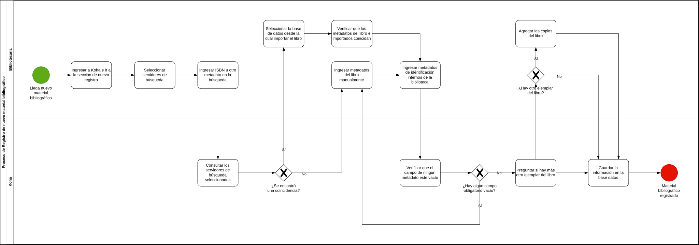

# 📄 Informe Técnico del Taller

## 🔖 Nombre del Taller
Taller 1 - Modelado de Proceso del Cliente con BPMN

## 👥 Integrantes del equipo
- Jorge Alarcon (Jorgealis)
- Julian Aguirre (JulianAguirreUnisabana)
- Brayan Presiga (Brayan-137)

## 🧠 Descripción general del trabajo
Conocer, entender y representar a través de un diagrama BPMN uno de los procesos más importante de nuestro cliente, en este caso: el proceso para añadir material bibliográfico a la plataforma Koha de la biblioteca pública municipal de Cogua - Rubiel Valencia Cossio. Para conocer y entender este proceso se recibió la capacitación en el proceso para añadir material bibliográfico y registrar usuarios, por parte de un contratista de la empresa contrata para implementar esta plataforma en las bibliotecas de Cundinamarca. De este proceso se extrajo los actores clave, las actividades que realiza cada uno de ellos, los gateways que se presentan en el proceso y como se relacionan entre ellos. Finalmente, se pusieron estos elementos dentro de un gráfico en la plataforma draw.io y se realizó una validación final para eliminar aquellas actividades o interacciones que no son tan relevantes para entender como funciona el proceso.

## 🔧 Proceso de desarrollo
1. **Obtención de información**: Nos reunimos con el cliente con el objetivo de entender el negocio, fuimos con varias preguntas que diseñamos previamente enfocadas en  obtener información clave sobre los procesos más importantes que se realizan en la organización (prestamos de libros, alimentación de las bases de datos de las plataformas de gestión, registro de usuarios) y escuchamos las necesidades del cliente en cada uno de estos procesos.
2. **Selección de proceso**: Organizamos toda la organización obtenida y deliberamos para decidir en que proceso enfocarnos, nos basamos en cual de los procesos le dolia más a la organización (alimentación de las bases de datos de las plataformas de gestión - Koha). Le comunicamos la decisión al cliente el cual valido nuestra decisión.
3. **Identificación de actores claves**: Analizamos la información referente al proceso escogido y extrajimos dos actores claves: la bibliotecaria y el sistema de gestión (Koha).
4. **Identificación del evento inicial y los posibles finales del proceso**: Identificamos como evento inicial el recibimiento de nuevo material bibliográfico, ya que idealmente se espera que todo el material que se encuentre en la biblioteca ya se encuentre registrado. El único final posible es que el libro sea registrado exitosamente, hay herramientas y opciones que evitan que termine de otra forma.
5. **Identificación de actividades**: Se listaron cada uno de los procesos claves que realizaba cada uno de los actores, centrados en extraer unicamente aquellos que son de gran relevancia para entender el proceso.
6. **Identificación de gateways**:  Se extrajo las condiciones, comprobaciones y preguntas que pudieran modificar o bifurcar el proceso.
7. **Construcción del diagrama**: Se añadieron todos los elementos anteriores en nuevo diagrama en la plataforma web draw.io, se organizaron y fueron siendo conectados en el orden de la secuencia del proceso.
8. **Validación y refinación**: Con el diagrama base construido se recorrieron los procesos para verificar si era necesario tenerlos o si se podían simplificar, dejando un diagrama más compacto y fácil de entender.

## 🧩 Análisis del modelo propuesto

### Estructura del modelo
El diagrama se modela como un único *pool* ("Proceso de Registro de nuevo material bibliográfico") dividido en dos *lanes* (carriles), uno por cada actor identificado:

- **Bibliotecaria**: agrupa las actividades manuales que requieren intervención humana (ingresar datos, seleccionar fuentes de búsqueda, corregir información, decidir sobre ejemplares y sobre si queda más material por registrar).
- **Koha**: agrupa las actividades que el sistema de gestión bibliotecaria ejecuta de forma automática una vez la bibliotecaria dispara la acción correspondiente (consultar servidores externos, validar campos obligatorios, guardar el registro en la base de datos).

El proceso tiene un único evento de inicio ("Llega nuevo material bibliográfico") y un único evento de fin ("Material bibliográfico registrado"), y utiliza compuertas exclusivas (XOR) para representar cinco puntos de decisión:

1. **¿El título ya está catalogado en Koha?** — evita duplicar el trabajo de catalogación si el libro que llega es un ejemplar adicional de un título ya existente.
2. **¿Se encontró una coincidencia?** — determina si los metadatos se importan automáticamente desde un servidor externo (Z39.50) o se deben digitar manualmente.
3. **¿Hay algún campo obligatorio vacío?** — valida que el registro esté completo antes de continuar, con un ciclo de corrección hacia la propia bibliotecaria.
4. **¿Hay más de un ejemplar del libro?** — permite agregar varias copias físicas del mismo título en una sola pasada.
5. **¿Queda material por registrar?** — permite procesar varios títulos distintos que llegan en un mismo lote, regresando al inicio de la catalogación sin necesidad de disparar un nuevo evento de inicio por cada libro.

### Cómo representa las necesidades del cliente
El modelo cubre el proceso **AS-IS** de catalogación tal como se ejecuta hoy en la biblioteca pública municipal de Cogua, desde que el material ya llegó físicamente hasta que queda registrado en Koha. Al incluir las compuertas de título ya catalogado, ejemplares múltiples y lote de varios libros, el diagrama refleja escenarios reales del día a día de la bibliotecaria y no solo el "camino feliz" de un único libro nuevo procesado de forma aislada.

### Supuestos tomados
- No existe un límite de reintentos si la búsqueda en los servidores externos no encuentra coincidencia; en ese caso siempre se continúa con carga manual de metadatos.
- Una falla o falta de respuesta de los servidores de búsqueda (timeout) se trata igual que "no se encontró coincidencia"; el modelo no distingue ambos casos como excepciones separadas.
- El catálogo público se actualiza automáticamente al guardar el registro, por lo que el proceso no contempla actividades de notificación a otros actores o áreas.
- El etiquetado físico del ejemplar se realiza antes de iniciar este proceso y queda fuera de su alcance.
- El alcance del proceso es únicamente el **registro/catalogación en Koha**; no incluye la decisión de adquisición ni la recepción física previa del material.

## 📈 Diagrama final entregado

## 📋 Tabla de actores, entidades o componentes (si aplica)

| Nombre del elemento | Tipo | Descripción | Responsable |
|---------------------|------|-------------|-------------|
| Bibliotecaria | Actor (rol humano) | Ejecuta las actividades manuales del proceso: ingresa metadatos de búsqueda, selecciona servidores y fuentes de importación, corrige datos importados que no coinciden, decide sobre ejemplares adicionales y sobre si queda más material por registrar en el lote. | Biblioteca pública municipal de Cogua |
| Koha | Sistema / actor automatizado | Plataforma de gestión bibliotecaria que ejecuta las actividades automáticas del proceso: consulta los servidores externos de catalogación (Z39.50), valida que ningún campo obligatorio quede vacío y almacena el registro final en la base de datos. | Biblioteca pública municipal de Cogua (implementado por el contratista de la Gobernación de Cundinamarca) |

## 🔍 Investigación complementaria

### Tema 1: Tareas de tipo servicio (Service Tasks) en BPMN

En nuestro diagrama, todas las actividades que ejecuta Koha de forma automática (consultar el servidor Z39.50, validar campos obligatorios, guardar el registro en la base de datos) las modelamos usando el marcador de **tarea de servicio (Service Task)**, así que quisimos investigar un poco más a fondo qué significa exactamente este tipo de tarea y cuándo se justifica su uso.

Una tarea de servicio representa trabajo que ejecuta un sistema o una aplicación sin intervención humana, típicamente invocando un servicio web, una API o consultando/actualizando una base de datos [1]. La idea clave es que, a diferencia de una tarea manual o una tarea de usuario (donde una persona hace el trabajo o interactúa con un sistema desde una interfaz), en la tarea de servicio el "actor" que ejecuta la actividad es el propio sistema, y por eso en nuestro modelo la ubicamos en el carril de Koha y no en el de la Bibliotecaria. Esto refuerza una decisión de modelado que tomamos casi intuitivamente: separar claramente qué hace la persona y qué hace la máquina, algo que en BPMN se resuelve justo con este tipo de tarea en vez de, por ejemplo, dejar todo como tareas genéricas sin distinción.

También encontramos que existen tipos "primos" de la tarea de servicio con los que a veces se confunde (tarea de script, tarea de envío/recepción de mensajes), y que la diferencia principal está en quién dispara la ejecución y qué tan "caja negra" es la lógica interna [1]. Para nuestro caso, como la bibliotecaria no ve ni controla el detalle de cómo Koha consulta el servidor externo o valida los campos, la tarea de servicio es la opción más adecuada frente a, por ejemplo, modelarlo como una tarea genérica sin tipo.

### Tema 2: Formas de representar bucles (loops) en BPMN

En el diagrama actual, el ciclo de "¿queda material por registrar?" y el ciclo de corrección de campos obligatorios los representamos regresando con una flecha desde la compuerta hasta una actividad anterior del proceso (un "loop-back" con gateway), en lugar de usar el marcador de bucle estándar sobre una actividad. Investigamos si esta era una forma válida de modelarlo o si existía una alternativa más "correcta" según BPMN.

Según lo que encontramos, BPMN 2.0 permite representar la repetición de actividades de al menos tres formas distintas: (1) simplemente volver a conectar el flujo hacia atrás usando una compuerta que evalúa una condición, (2) usar el marcador de **loop estándar** (una flechita curva dentro de la actividad) cuando una misma actividad debe repetirse mientras se cumpla una condición booleana, y (3) usar el marcador de **multi-instancia**, cuando lo que se repite es la ejecución de la actividad sobre varios elementos de una colección (por ejemplo, varios ejemplares del mismo libro) [2]. La opción que usamos en el diagrama (regresar con una flecha desde la compuerta) es, según estas fuentes, la forma más explícita y "expandida" de mostrar un bucle, porque dibuja visiblemente el ciclo completo del proceso, mientras que el marcador de loop estándar es más compacto pero oculta el detalle de la condición dentro de las propiedades de la actividad.

Un punto que nos pareció importante es la advertencia de no mezclar ambas formas sobre la misma actividad (por ejemplo, poner un marcador de loop y además hacerla regresar con una compuerta), ya que esto generaría un "loop dentro de otro loop" y volvería ambigua la cantidad real de repeticiones [3]. En nuestro caso no tenemos ese problema porque optamos consistentemente por la representación con compuerta y flujo de regreso en los cinco puntos de decisión del diagrama, lo cual, si bien es más "extendido" visualmente que usar marcadores de loop, tiene la ventaja de dejar explícitas las condiciones de salida directamente sobre las flechas del proceso, algo más fácil de leer para alguien que no está familiarizado con la notación de marcadores.

## 📚 Referencias

**Sobre tareas de servicio:**

- [1] ProcessMind. *Guía de Activities y Tipos de Task BPMN*. https://processmind.com/resources/docs/bpmn-building-blocks/activities

**Sobre representación de bucles (loops):**
- [2] Stachecki, F. *Loops in BPMN. You'll finally remember what ≡ and III mean!* LinkedIn, 2023. https://www.linkedin.com/pulse/loops-bpmn-youll-finally-remember-what-iii-mean-filip-stachecki
- [3] Trisotech / Method and Style. *Repeating Activities in BPMN*. https://www.methodandstyle.com/blog/repeating-activities-in-bpmn/

---

Este documento hace parte de la entrega del taller 1 del curso AREM (Arquitectura Empresarial) - Universidad de La Sabana.