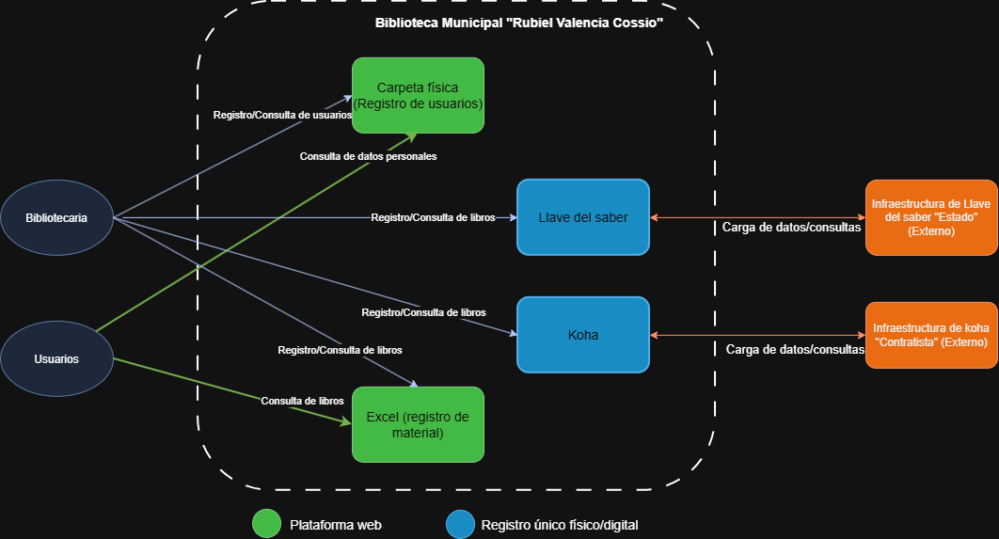

# 📄 Informe Técnico del Diagrama de Contexto de Negocio
## 🔖 Taller 2: Modelo de Información y Diagrama de Contexto
_Taller 2 - Modelo de Información y Diagrama de Contexto_

## 👥 Integrantes del equipo
- Jorge Alarcón (Jorgealis)
- Julian Aguirre (JulianAguirreUnisabana)
- Brayan Presiga (Brayan-137)

## 🧠 Descripción general del trabajo
El objetivo de este taller fue construir el Diagrama de Contexto de Negocio de la Biblioteca Pública Municipal Rubiel Valencia Cossio, identificando los actores externos que interactúan con la biblioteca y los sistemas (internos y externos) que soportan sus procesos de negocio. A partir de la información recolectada en la Ficha de Caracterización y en el Documento de Visión de Arquitectura, se representaron las relaciones entre la bibliotecaria y los usuarios con los distintos medios de registro y consulta que utiliza actualmente la biblioteca: la carpeta física, la hoja de Excel y las plataformas Llave del Saber y Koha, junto con la infraestructura externa que soporta a estas dos últimas.

## 🔧 Proceso de desarrollo
Para el desarrollo del diagrama, el equipo partió de la información recopilada en la Ficha de Caracterización sobre las tecnologías actuales de la biblioteca y sus procesos clave (préstamos, gestión de eventos y gestión de inventario). A partir de ahí, se clasificaron los elementos identificados en tres niveles: actores externos (Bibliotecaria y Usuarios), sistemas internos de la biblioteca (Carpeta física, Excel, Llave del Saber y Koha) y sistemas externos de infraestructura (la infraestructura de Llave del Saber, a cargo del Estado, y la infraestructura de Koha, a cargo de un contratista externo).

El diagrama se elaboró en draw.io, representando primero los actores y luego los flujos de interacción (registro y consulta) hacia cada sistema interno, para finalmente conectar los sistemas internos con su respectiva infraestructura externa mediante flujos de carga de datos y consultas. Se utilizó un código de colores para diferenciar el tipo de elemento: azul para plataformas web, verde para registros únicos físicos/digitales y naranja para la infraestructura externa, facilitando así la lectura del diagrama.

## 🧩 Análisis del modelo propuesto
El modelo entregado se estructura alrededor de dos actores externos —la bibliotecaria y los usuarios— que interactúan con cuatro sistemas internos de la biblioteca. La bibliotecaria concentra la mayoría de las interacciones, ya que es la única encargada de registrar y consultar información en la carpeta física, en Excel y en las dos plataformas de gestión de material (Llave del Saber y Koha), mientras que los usuarios interactúan principalmente para consultar libros, tanto en las plataformas como en Excel.

Este modelo representa fielmente la realidad identificada en la Ficha de Caracterización: la coexistencia de dos sistemas de gestión de inventario que deben alimentarse en paralelo, y la dependencia de medios manuales (carpeta física y Excel) para procesos que aún no están completamente digitalizados. Las conexiones hacia las infraestructuras externas evidencian además que la biblioteca no tiene control directo sobre la disposición ni el mantenimiento de Llave del Saber y Koha, dado que estas dependen de terceros (el Estado y un contratista, respectivamente), lo cual es coherente con la restricción de acceso limitado a dichas plataformas mencionada por la cliente.

Como supuesto, se asumió que la carpeta física y la hoja de Excel seguirán funcionando como registros complementarios mientras no se centralice toda la información en una única plataforma, ya que actualmente no existe una fuente única de verdad para los datos de usuarios y de material bibliográfico.

## 📈 Diagrama final entregado

> Figura 1: Diagrama de Contexto (archivo: `02-modelo-informacion/DiagramaDeContexto.drawio.png`)
> (Si GitHub no renderiza la imagen en la vista previa, puede abrirla directamente en: https://github.com/Jorgealis/PROYECTO-ARQUI-EMPRESARIAL/blob/main/02-modelo-informacion/DiagramaDeContexto.drawio.png)

## 📋 Tabla de actores, entidades o componentes

| Nombre del elemento | Tipo | Descripción | Responsable |
|---|---|---|---|
| Bibliotecaria | Actor externo | Encargada de registrar y consultar usuarios, libros y material en todos los sistemas de la biblioteca | Biblioteca (Ana Cecilia Pastrana Rodríguez) |
| Usuarios | Actor externo | Personas afiliadas o visitantes que consultan libros y material disponible | Comunidad de Cogua |
| Carpeta física | Sistema interno | Registro único físico de usuarios afiliados a la biblioteca | Biblioteca |
| Excel | Sistema interno | Registro digital de consulta de material y visitantes | Biblioteca |
| Llave del Saber | Sistema interno (plataforma web) | Sistema para registro y consulta de libros y material bibliográfico | Biblioteca |
| Koha | Sistema interno (plataforma web) | Sistema para registro y consulta de libros y material bibliográfico | Biblioteca |
| Infraestructura de Llave del Saber | Sistema externo | Infraestructura que soporta la plataforma Llave del Saber, gestionada por el Estado | Estado |
| Infraestructura de Koha | Sistema externo | Infraestructura que soporta la plataforma Koha, gestionada por un contratista externo | Contratista |

## 🔍 Investigación complementaria
### Tema investigado:
Buenas prácticas para la elaboración de diagramas de contexto en arquitectura empresarial.

### Resumen:
Un diagrama de contexto de negocio busca ofrecer una vista de alto nivel de cómo interactúan los actores externos con los sistemas de una organización, sin entrar en el detalle interno de cada proceso. Según Avolution, este tipo de representación visual permite entender estructuras complejas, comunicar conceptos técnicos a audiencias no técnicas y apoyar la toma de decisiones al hacer explícitas las relaciones entre procesos, aplicaciones, datos y tecnología de una organización para alcanzar los objetivos de negocio, funcionando como referencias claras para comprender estructuras complejas y comunicar conceptos técnicos a partes interesadas técnicas y no técnicas. 

Una de las recomendaciones más relevantes para este tipo de diagramas es evitar mezclar niveles de detalle: se debe utilizar un enfoque de modelado por capas para evitar que algunos diagramas queden demasiado abstractos y de alto nivel, mientras otros terminan sobrecargados de detalles.  Esto se relaciona directamente con el taller, ya que el diagrama de contexto elaborado se mantuvo deliberadamente a nivel de actores y sistemas (sin describir procesos internos ni flujos detallados de datos), dejando ese nivel de profundidad para los diagramas BPMN y de arquitectura de aplicaciones que se desarrollarán en talleres posteriores.

## 📚 Referencias
- [1] Avolution. *Diagramas de arquitectura empresarial: tipos, beneficios y guía de implementación*. 2026. https://www.avolutionsoftware.com/es/our-resources/benefits-of-enterprise-architecture-diagrams/
- [2] Avolution. *Mejores prácticas de Arquitectura Empresarial: diagramas*. 2024. https://www.avolutionsoftware.com/news/mejores-practicas-de-arquitectura-empresarial-diagramas/

Fuente asistida por IA: Claude (Anthropic), agosto 2026.
---
_Este documento hace parte de la entrega del taller 2 del curso AREM (Arquitectura Empresarial) - Universidad de La Sabana._
