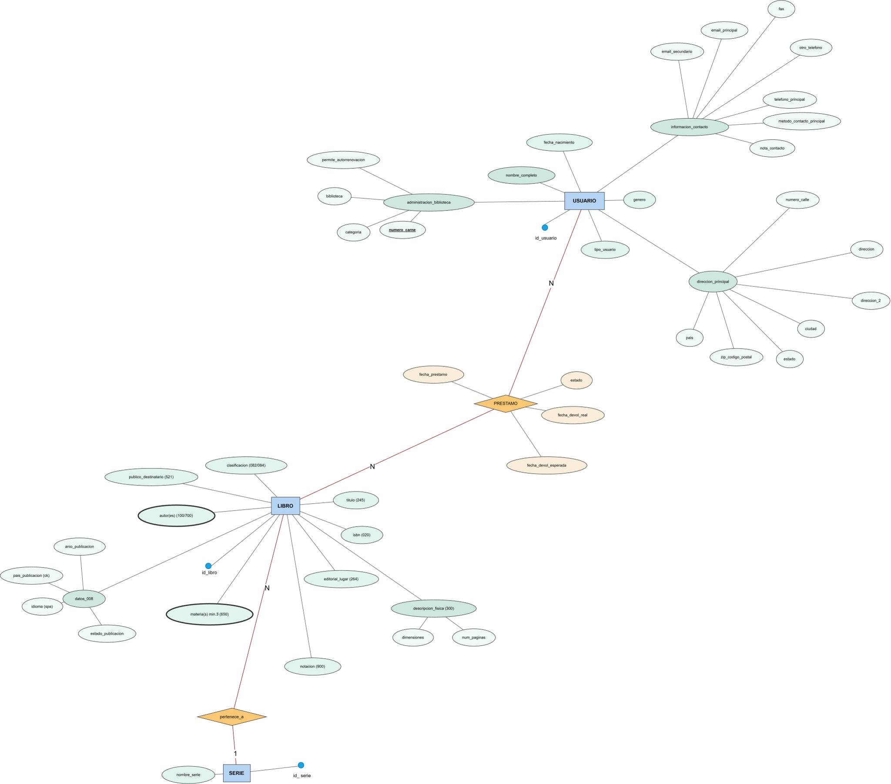

# 📄 Informe Técnico del Taller

## 🔖 Nombre del Taller
**Taller 2 – Modelo Entidad-Relación (ERD): Biblioteca – Registro de Libros**
## 👥 Integrantes del equipo
- Jorge Alarcon
- Julian Aguirre
- Brayan Presiga

## 🧠 Descripción general del trabajo

El objetivo del taller fue diseñar un modelo entidad-relación (ERD) para representar la información relacionada con una biblioteca y el registro de libros, usuarios y préstamos. El modelo busca organizar los datos de manera estructurada, identificando las principales entidades del sistema, sus atributos y las relaciones que existen entre ellas.

Para desarrollar el modelo se utilizó **diagrams.net (Draw.io)**. Primero se identificaron las entidades principales del sistema: **LIBRO, SERIE y USUARIO**. Posteriormente se agregaron las relaciones **pertenece_a** y **PRESTAMO**, junto con los diferentes atributos necesarios para describir cada elemento.

El modelo también incorpora información bibliográfica del libro, como el ISBN, título, clasificación, autores, materias, año y país de publicación, idioma y descripción física. Para los usuarios se incluyeron datos personales, información de contacto y dirección.

---

## 🔧 Proceso de desarrollo

Para la construcción del ERD se comenzó identificando los elementos principales que intervienen en el funcionamiento de una biblioteca.

La primera entidad definida fue **LIBRO**, debido a que representa el elemento central del sistema. A esta entidad se asociaron diferentes atributos bibliográficos, entre ellos **id_libro, isbn, titulo, clasificacion, notacion, editorial_lugar, publico_destinatario, autor(es), materia(s), datos_008** y **descripcion_fisica**.

Dentro de la información bibliográfica también se organizaron datos relacionados con la publicación, como **anio_publicacion, pais_publicacion, idioma y estado_publicacion**. Para la descripción física del libro se incluyeron **num_paginas** y **dimensiones**.

Después se incorporó la entidad **SERIE**, que contiene el atributo **id_serie** y **nombre_serie**. La relación **pertenece_a** permite representar la asociación entre un libro y una serie.

Posteriormente se creó la entidad **USUARIO**, identificada mediante **id_usuario**. Esta entidad contiene información como **tipo_usuario, fecha_nacimiento, genero y nombre_completo**, además de información relacionada con la dirección y los datos de contacto.

Finalmente se incorporó la relación **PRESTAMO**, que conecta a los usuarios con los libros. Esta relación contiene información específica de cada préstamo, incluyendo **fecha_prestamo, fecha_devol_esperada, fecha_devol_real y estado**.

Durante el desarrollo se buscó separar la información en diferentes elementos para evitar concentrar todos los datos en una sola entidad y facilitar posteriormente la implementación de una base de datos.

---

## 🧩 Análisis del modelo propuesto

### Estructura del modelo

El modelo está organizado principalmente alrededor de tres entidades:

- **LIBRO:** almacena la información bibliográfica y física de los libros.
- **SERIE:** permite representar las series a las que pueden pertenecer los libros.
- **USUARIO:** almacena la información de las personas que utilizan el sistema de biblioteca.

Además, se presentan dos relaciones principales:

- **pertenece_a:** relaciona los libros con las series.
- **PRESTAMO:** representa el préstamo de libros a los usuarios.

La entidad **LIBRO** es la que concentra la mayor cantidad de información debido a la variedad de datos bibliográficos necesarios para identificar y describir una publicación.

### Representación de las necesidades del cliente

El modelo permite representar las operaciones básicas que tendría un sistema de biblioteca. En primer lugar, permite almacenar y consultar información detallada sobre los libros disponibles. También permite organizar los libros que pertenecen a una determinada serie.

Por otro lado, la información del **USUARIO** permite registrar diferentes tipos de usuarios y conservar sus datos personales, dirección e información de contacto.

La relación **PRESTAMO** permite registrar el historial de circulación de los libros, ya que almacena la fecha en que se realizó el préstamo, la fecha esperada de devolución, la fecha real de devolución y el estado del préstamo.

De esta manera, el modelo cubre tres aspectos principales del sistema: **catálogo bibliográfico, registro de usuarios y control de préstamos**.

### Supuestos tomados

Para la elaboración del modelo se asumió que:

1. Cada libro cuenta con un identificador propio denominado **id_libro**.
2. Cada serie cuenta con un identificador denominado **id_serie**.
3. Cada usuario cuenta con un identificador denominado **id_usuario**.
4. La información bibliográfica se almacena como parte de la descripción del libro.
5. Un préstamo debe registrar tanto las fechas relacionadas con la devolución como su estado.
6. La información de dirección y contacto se descompone en diferentes atributos para almacenar sus componentes.
7. Los autores y las materias se consideran atributos asociados al libro dentro del modelo presentado.
8. El modelo está orientado principalmente al registro y consulta de información bibliográfica y al control de préstamos.

---

## 📈 Diagrama final entregado

> **Insertar aquí una captura de pantalla del diagrama ERD final realizado en Draw.io.**

El diagrama representa las entidades **LIBRO, SERIE y USUARIO**, las relaciones **pertenece_a** y **PRESTAMO**, y los diferentes atributos asociados a cada elemento.

---

## 📋 Tabla de actores, entidades o componentes

| Nombre del elemento | Tipo | Descripción | Responsable |
|---|---|---|---|
| LIBRO | Entidad | Representa los libros registrados en la biblioteca y contiene su información bibliográfica y física. | Sistema de biblioteca |
| SERIE | Entidad | Representa una serie bibliográfica a la que puede pertenecer un libro. | Sistema de biblioteca |
| USUARIO | Entidad | Representa a las personas registradas que utilizan los servicios de la biblioteca. | Sistema de biblioteca |
| pertenece_a | Relación | Representa la relación entre un libro y una serie. | Sistema de biblioteca |
| PRESTAMO | Relación | Representa el préstamo de un libro a un usuario y almacena las fechas y el estado correspondiente. | Sistema de biblioteca |
| id_libro | Identificador | Identifica de manera individual un libro. | Sistema de biblioteca |
| id_serie | Identificador | Identifica una serie. | Sistema de biblioteca |
| id_usuario | Identificador | Identifica un usuario. | Sistema de biblioteca |
| isbn | Atributo | Identificador ISBN asociado al libro. | Sistema de biblioteca |
| titulo | Atributo | Nombre o título de la publicación. | Sistema de biblioteca |
| autor(es) | Atributo | Registra el autor o autores asociados al libro. | Sistema de biblioteca |
| materia(s) | Atributo | Registra las materias o temas asociados al libro. | Sistema de biblioteca |
| fecha_prestamo | Atributo de relación | Registra la fecha en que se realiza el préstamo. | Sistema de biblioteca |
| fecha_devol_esperada | Atributo de relación | Registra la fecha prevista para devolver el libro. | Sistema de biblioteca |
| fecha_devol_real | Atributo de relación | Registra la fecha en que realmente se devuelve el libro. | Sistema de biblioteca |
| estado | Atributo de relación | Permite registrar el estado del préstamo. | Sistema de biblioteca |

---

Este documento hace parte de la entrega del taller 2 del curso AREM (Arquitectura Empresarial) - Universidad de La Sabana.
