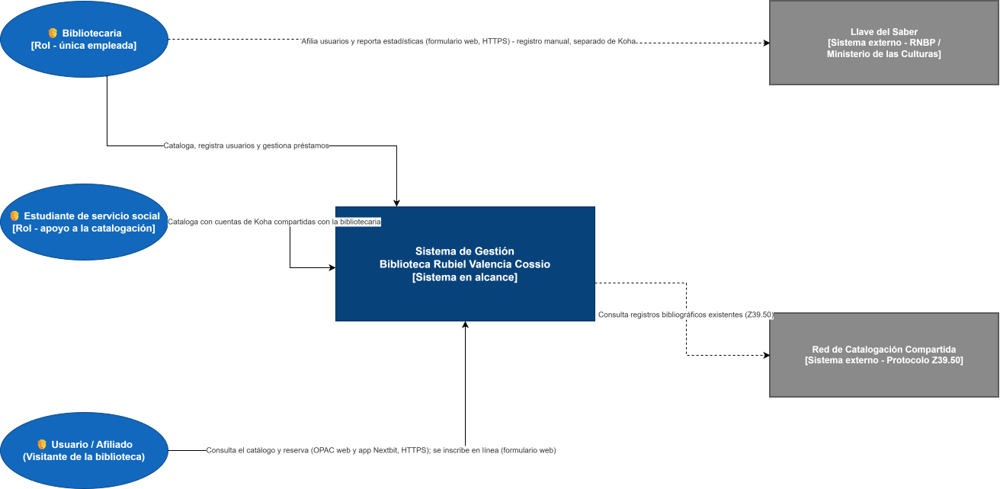
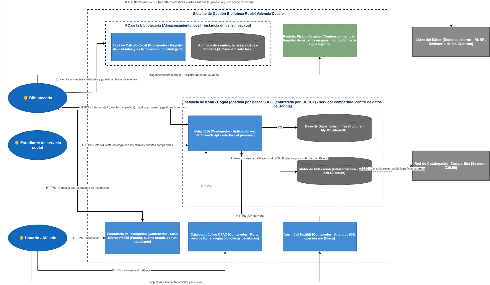

# 📄 Informe Técnico del Taller 3: Arquitectura Actual del Sistema con el Modelo C4

## 🔖 Nombre del Taller
_Taller 3 - Arquitectura Actual del Sistema con el Modelo C4_

## 👥 Integrantes del equipo
- Jorge Alarcón
- Julián Aguirre
- Brayan Presiga

_(Equipo ARQUITECH)_

## 🧠 Descripción general del trabajo
El objetivo de este taller es representar la arquitectura **actual (AS-IS)** de la Biblioteca Pública Municipal Rubiel Valencia Cossio usando las vistas **C1 (Contexto)** y **C2 (Contenedores)** del modelo C4. Este trabajo corresponde a la Parte 2 del taller — la aplicación al cliente real — y se construye sobre el diagnóstico AS-IS y el levantamiento de información que el equipo ya había realizado con la bibliotecaria (entrevista y ficha de caracterización del cliente). Esta versión incorpora lo que el equipo confirmó después en los Talleres 4 y 6: el catálogo público (OPAC) y la app Nextbit, que Biteca opera la instancia de Koha, el formulario de inscripción en Microsoft Forms y los estudiantes de servicio social que catalogan con cuentas compartidas.

## 🔧 Proceso de desarrollo
Seguimos la metodología de 4 pasos de la guía del taller, una vista a la vez:

1. **C1 — Identificación de actores y límites del sistema.** A partir de la ficha de caracterización y el diagnóstico AS-IS ya elaborados, identificamos tres actores humanos, modelados como roles y no como personas (la bibliotecaria, el estudiante de servicio social y el usuario/afiliado), y definimos el **sistema en alcance** como el conjunto de herramientas que la biblioteca opera directamente. Los sistemas de terceros que no están bajo control del equipo ni del cliente (Llave del Saber y la red de catalogación compartida vía Z39.50) se marcaron como externos.
2. **C2 — Descomposición en contenedores.** Investigamos la arquitectura técnica real de Koha (documentada públicamente) para descomponer el sistema en alcance de forma fiel: Koha como aplicación web, su base de datos relacional y su motor de indexación, además de las herramientas paralelas que hoy sostienen procesos que Koha todavía no cubre (Excel, los archivos locales del PC de la bibliotecaria y el registro físico en papel) y de los canales digitales del usuario confirmados en el Taller 4 (catálogo público OPAC y app Nextbit) y en el Taller 6 (formulario de inscripción en Microsoft Forms). La instancia de Koha, su base de datos y su motor de indexación se agruparon como la instancia que opera Biteca.
3. **Validación cruzada con el diagnóstico previo.** Contrastamos ambos diagramas contra los hallazgos ya documentados en el AS-IS (duplicidad de sistemas, dependencia de infraestructura externa, canales digitales del usuario) y contra los Talleres 4 y 6 para asegurarnos de que el modelo C4 no contradijera, sino que reforzara con notación formal, lo que ya se había diagnosticado de forma más narrativa.
4. **Herramienta:** ambos diagramas se construyeron en draw.io, siguiendo la leyenda de notación de la guía (persona = óvalo azul, sistema en alcance = rectángulo azul oscuro, sistema externo = rectángulo gris de doble borde, contenedor = rectángulo azul claro, infraestructura = cilindro/rectángulo gris).

## 🧩 Análisis del modelo propuesto

**Cómo se estructura el modelo:**
- El **C1** muestra 3 actores (roles), 1 sistema en alcance y 2 sistemas externos, con las 5 relaciones correspondientes etiquetadas. La relación con Llave del Saber sale de la Bibliotecaria, igual que en el C2.
- El **C2** abre el sistema en alcance en 6 contenedores (Koha, Excel, Registro Físico, formulario de inscripción, catálogo público OPAC y app Nextbit) y 3 piezas de infraestructura (base de datos de Koha, su motor de indexación y el almacenamiento local del PC de la bibliotecaria), manteniendo visibles los mismos actores y sistemas externos del C1, tal como exige la metodología. Koha, su base de datos y su motor de indexación se agrupan como la instancia de Cogua que opera Biteca, y el Excel y los archivos de eventos se agrupan en el PC de la bibliotecaria, que es el mismo componente "Almacenamiento local" del mapa de infraestructura del Taller 4.

**Cómo representa las necesidades del cliente:**
- El diagrama C2 hace explícita, con una arista propia, la **duplicidad de sistemas** que la ficha de caracterización señala como el problema #2: la bibliotecaria alimenta Koha *y* Llave del Saber por separado — la relación entre la Bibliotecaria y Llave del Saber sale directamente de ella, no del sistema Koha, precisamente porque hoy no existe integración entre ambos.
- El Usuario/Afiliado se relaciona con el sistema por tres canales digitales que el equipo confirmó en los Talleres 4 y 6: el catálogo público (OPAC, en su propio subdominio) y la app Nextbit, ambos hacia la instancia de Koha por HTTPS, y el formulario de inscripción de Microsoft Forms. Esto matiza el problema #3 de la ficha (falta de una plataforma digital para consultar el inventario): el canal ya existe, pero solo tiene cargado cerca del 10 % de la colección, por lo que la brecha está en el contenido catalogado y no en el canal (Taller 6, ítem 15).
- El Estudiante de servicio social aparece como actor propio porque catalogan en Koha con dos cuentas con permisos de edición que comparten con la bibliotecaria (Taller 6, ítem 9). Por eso la bibliotecaria no es la única operadora del sistema.
- Incluir el "Registro Físico (Carpeta)" como contenedor, aunque no sea software, mantiene la fidelidad del AS-IS: es una pieza real del proceso actual y va a ser insumo directo de cualquier propuesta TO-BE de migración de datos. Como hoy la inscripción se hace en el formulario en línea, queda por confirmar con la bibliotecaria si la carpeta sigue en uso o ya es histórica.

**Supuestos tomados:**
1. Se modeló "Sistema de Gestión Biblioteca Rubiel Valencia Cossio" como una única caja en el C1, aunque en la realidad no es un sistema unificado sino tres herramientas fragmentadas — esa fragmentación se revela intencionalmente al bajar al nivel C2, que es justamente el propósito de cada nivel de abstracción en C4.
2. Se asumió que Koha corre sobre MySQL/MariaDB con un motor de indexación tipo Zebra (u opcionalmente Elasticsearch), siguiendo la arquitectura estándar documentada del proyecto Koha — esto no fue confirmado por el proveedor: Biteca informó que aloja la instancia de Cogua, pero por restricciones contractuales no entregó detalles internos (Taller 4).
3. Se asumió que la relación entre la bibliotecaria y Llave del Saber es completamente independiente de Koha (sin sincronización automática), con base en el problema #2 documentado en la ficha de caracterización del cliente.
4. La instancia de Koha de Cogua la opera Biteca S.A.S., contratada por IDECUT, en un servidor compartido con otros municipios del centro de datos de Bogotá. Esto fue confirmado por Biteca en el Taller 4 y reemplaza el supuesto anterior de que la alojaba la RNBP.
5. Se asumió, con base en la entrevista (Taller 6), que los estudiantes de servicio social usan las mismas dos cuentas de Koha con permisos de edición que la bibliotecaria, y que la bibliotecaria consulta las respuestas del formulario de inscripción para registrar a los usuarios en Koha y en Llave del Saber. Ese último flujo no fue confirmado.
6. El protocolo entre Koha y el motor de indexación se rotuló como Z39.50 interno, por ser el que usa Zebra en la instalación estándar; debe confirmarse con Biteca.
7. No se incluyó el proceso de préstamos ni de gestión de eventos en el C2 (aunque sí aparecen como procesos de negocio en el diagnóstico AS-IS previo), porque el foco de modelado acordado con la bibliotecaria para esta primera fase es el registro de material bibliográfico.

## 📈 Diagrama final entregado

- [`c1-contexto-final.drawio`](c1-contexto-final.drawio) — Vista de Contexto (C1)

- [`c2-contenedores-final.drawio`](c2-contenedores-final.drawio) — Vista de Contenedores (C2)

## 📋 Tabla de actores, entidades o componentes

| Nombre del elemento | Tipo | Descripción | Responsable |
|---|---|---|---|
| Bibliotecaria | Actor (rol) | Responsable de la operación diaria de la biblioteca; ejecuta el registro, el préstamo y el reporte de información (única empleada, con apoyo de estudiantes de servicio social) | Cliente |
| Estudiante de servicio social | Actor (rol) | Apoya la catalogación en Koha con cuentas con permisos de edición compartidas con la bibliotecaria | Cliente |
| Usuario / Afiliado | Actor (rol) | Visitante que consulta el catálogo (OPAC o app Nextbit), se inscribe en el formulario en línea y solicita préstamos | Cliente |
| Sistema de Gestión Biblioteca Rubiel Valencia Cossio | Sistema en alcance | Conjunto de herramientas que la biblioteca opera o usa directamente (Koha + Excel + formulario + registro físico) | Equipo ARQUITECH (modelado) |
| Koha | Contenedor | ILS de código abierto; cataloga material bibliográfico con estándar MARC21. Instancia de Cogua en servidor compartido | Biteca (instancia) / Biblioteca (uso) |
| Catálogo público OPAC | Contenedor | Portal web público de Koha en cogua.bibliotecasidecut.com para consultar el catálogo | Biteca |
| App móvil Nextbit | Contenedor | Aplicación Android/iOS para consultar el catálogo, reservar y renovar; se conecta a la instancia de Koha | Biteca |
| Formulario de inscripción | Contenedor (SaaS) | Formulario de Microsoft Forms (Microsoft 365) donde el usuario se inscribe; alojado en una cuenta creada por un estudiante | Biblioteca / Alcaldía (por trasladar a cuenta institucional) |
| Hoja de Cálculo Excel | Contenedor | Registro y consulta manual de visitantes y de la colección aún no catalogada; vive en el PC de la bibliotecaria | Bibliotecaria |
| Registro Físico (Carpeta) | Contenedor manual | Registro en papel de datos de usuarios; por confirmar si sigue vigente | Bibliotecaria |
| PC de la bibliotecaria (almacenamiento local) | Infraestructura | Única copia de la hoja de Excel y de los archivos de eventos, talleres, videos y recursos; sin backup | Bibliotecaria |
| Base de Datos Koha | Infraestructura | Persistencia de registros bibliográficos y de usuarios (MySQL/MariaDB) | Biteca |
| Motor de Indexación | Infraestructura | Búsqueda de catálogo y protocolo Z39.50 (Zebra / Elasticsearch) | Biteca |
| Llave del Saber | Sistema externo | Plataforma nacional de estadísticas, usuarios y servicios bibliotecarios (RNBP) | Ministerio de las Culturas / Fundación Carvajal |
| Red de Catalogación Compartida | Sistema externo | Bibliotecas conectadas vía Z39.50 para copiar registros bibliográficos existentes | Terceros (otras bibliotecas y redes) |

## 🔍 Investigación complementaria

### Tema investigado
Arquitectura técnica real de Koha (ILS de código abierto) y del Sistema Nacional de Información Llave del Saber, como sustento para decidir qué piezas del ecosistema de la biblioteca son "sistema en alcance" y cuáles son "sistemas externos" en el modelo C4.

### Resumen
La arquitectura de Koha está documentada públicamente por su propia comunidad: el sistema se construye sobre una base de código en Perl y JavaScript, persiste su información transaccional en una base de datos relacional (MySQL o MariaDB) y almacena los registros bibliográficos en formato MARC21. Para la búsqueda y recuperación de catálogo, Koha se apoya históricamente en el motor de indexación Zebra —que además implementa el protocolo Z39.50, usado tanto para copiar registros de catálogos externos como para exponer el propio catálogo a otras bibliotecas—, aunque Elasticsearch se ha ido consolidando como alternativa más moderna. Esta separación entre "datos transaccionales" y "búsqueda/interoperabilidad bibliográfica" es exactamente la que representamos en el C2 como dos piezas de infraestructura distintas.

Llave del Saber, en cambio, no es un ILS de propósito general sino una plataforma de estadísticas y gestión construida específicamente para la Red Nacional de Bibliotecas Públicas: la desarrolla desde 2013 el Ministerio de las Culturas en alianza con la Fundación Carvajal, centraliza la identificación de usuarios y el reporte de servicios de cerca de 1.400 bibliotecas públicas del país, es de acceso totalmente web (no requiere instalación local) y las credenciales de acceso las asigna directamente la RNBP a cada biblioteca. Esto confirma que Llave del Saber está genuinamente fuera del control técnico del cliente, lo que sustenta su clasificación como sistema externo en el C1 y el C2.

Comparar ambas arquitecturas ayudó a justificar la frontera del sistema en alcance: Koha, aunque también depende de infraestructura de hosting gestionada por un tercero (Biteca S.A.S., contratada por IDECUT), es el sistema que la bibliotecaria opera y personaliza directamente día a día (cataloga, corrige metadatos, crea ítems), por lo que se modela como parte del sistema en alcance; Llave del Saber es una herramienta cerrada y administrada centralmente en la que la biblioteca únicamente alimenta datos, sin ninguna capacidad de configuración arquitectónica, por lo que corresponde clasificarla como sistema externo según la metodología C4.

## 📚 Referencias
Ver [`referencias.md`](referencias.md).

---

_Este documento hace parte de la entrega del Taller 3 del curso AREM (Arquitectura Empresarial) - Universidad de La Sabana._
