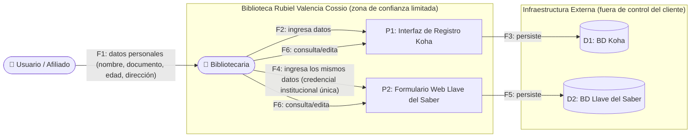

# 📄 Informe Técnico del Taller

## 🔖 Nombre del Taller
_Taller 5 - Evaluación de Seguridad con STRIDE_

## 👥 Integrantes del equipo
- Jorge Alarcón
- Julián Aguirre
- Brayan Presiga

_(Equipo ARQUITECH)_

## 🧠 Descripción general del trabajo
El objetivo de este taller es aplicar el marco STRIDE (Spoofing, Tampering, Repudiation, Information Disclosure, Denial of Service, Elevation of Privilege) sobre un flujo crítico de la Biblioteca Pública Municipal Rubiel Valencia Cossio, para identificar amenazas de seguridad concretas y proponer mitigaciones priorizadas por riesgo. Se eligió como flujo crítico el **registro y gestión de datos personales de usuarios/afiliados en Koha y Llave del Saber**, porque es el punto donde confluyen los tres hallazgos más sensibles de los talleres anteriores: duplicidad de sistemas (Taller 3), ausencia de redundancia y credencial única (Taller 4), y el hecho de que ese flujo maneja datos personales de menores de edad.

## 🔧 Proceso de desarrollo
Seguimos la metodología de 5 pasos de la guía del taller:

1. **Elegir el flujo y dibujar su DFD** — se representó el flujo de registro de datos personales como un diagrama de flujo de datos, marcando el límite de confianza entre la biblioteca (zona bajo control directo) y la infraestructura externa de Koha y Llave del Saber (fuera de control técnico del cliente).
2. **Identificar los elementos a analizar** — se listaron los procesos (interfaz de registro en Koha, formulario web de Llave del Saber), los almacenes de datos (BD Koha, BD Llave del Saber) y los flujos entre la bibliotecaria, el usuario/afiliado y ambos sistemas.
3. **Aplicar las 6 categorías STRIDE** — se formuló al menos una amenaza concreta por categoría sobre un elemento específico del DFD.
4. **Reconocimiento pasivo autorizado** — en lugar de asumir qué controles existen hoy en Llave del Saber, se buscó evidencia pública real: el manual oficial de usuario del sistema (publicado por la propia RNBP) confirma textualmente que **"cada biblioteca tendrá un único usuario de acceso para todas las personas que trabajan en la biblioteca"** y que esa contraseña **"será el mismo para todos los sistemas de información nacionales"** de la RNBP. Esta evidencia, obtenida por observación pasiva de documentación pública (sin ninguna prueba activa contra el sistema), cambió por completo el nivel de detalle y la severidad de las amenazas T1 y T3 frente a lo que hubiéramos escrito por simple suposición.
5. **Evaluar impacto y priorizar por riesgo** — se completaron impacto, probabilidad y nivel de riesgo para cada amenaza, y se ordenó la tabla de mayor a menor riesgo.

En la Parte 1 (trabajo en clase), aplicamos primero la misma metodología completa sobre el caso base de EdukIT siguiendo el ejemplo ya resuelto en la guía, y adicionalmente completamos el reto práctico #1 de OWASP Juice Shop (login bypass) en una instancia local, registrando el hallazgo como una fila adicional (T7) en `tabla-stride-clase.xlsx` — sin repetir esa técnica activa contra ningún sistema real, tal como exige la guía.

## 🧩 Análisis del modelo propuesto

**Cómo se estructura el modelo:**
El DFD tiene 1 actor externo (Usuario/Afiliado), 1 actor interno operador (Bibliotecaria), 2 procesos (interfaz de Koha, formulario de Llave del Saber) y 2 almacenes de datos (BD Koha, BD Llave del Saber externa). Sobre estos 5 elementos se identificaron 6 amenazas, una por cada categoría STRIDE, en `entrega/tabla-stride-cliente.xlsx`.

**Cómo representa las necesidades del cliente:**
Dos de las seis amenazas (T1 y T3) giran alrededor del mismo hallazgo real: **la credencial de acceso institucional es única por biblioteca y se reutiliza en todos los sistemas nacionales**. Esto no es una suposición — es una cita textual del manual oficial de Llave del Saber — y tiene una implicación directa sobre la ficha de caracterización del cliente: la bibliotecaria ya solicitó un auxiliar, y el día que ese auxiliar empiece a trabajar, **ambas personas entrarán con la misma cuenta**, sin ninguna forma de auditar quién hizo qué. La amenaza T4 (exposición de datos de menores) conecta directamente con que la plataforma maneja categorías de usuario como "Niños (6 a 12 años)" y "Primera Infancia (0 a 5 años)", lo cual activa protecciones reforzadas bajo la Ley 1581 de 2012. La amenaza T5 retoma textualmente el hallazgo ya diagnosticado en el Taller 4 (conexión a internet sin respaldo), y se refuerza con un dato adicional encontrado en el propio manual de Llave del Saber: el sistema ya contempla que el internet puede fallar, porque permite registrar actividades con fecha retroactiva "cuando el servicio de internet no está disponible" — es decir, el proveedor asume como normal una condición que nosotros ya habíamos señalado como un riesgo.

**Qué supuestos se tomaron:**
1. No se tuvo acceso a ningún sistema real del cliente (ni Koha ni Llave del Saber) con credenciales — todo el reconocimiento fue pasivo, sobre documentación pública oficial. La columna "Controles de Seguridad Existentes" para T2, T3 y T6 combina esa evidencia pública con los hallazgos ya diagnosticados en los Talleres 3 y 4, no con observación directa del sistema en producción.
2. Se asumió que la infraestructura de hosting de Koha usada por esta biblioteca en particular no ha sido auditada por el equipo (T4) — es una limitación explícita del alcance de este taller, no un hallazgo confirmado de vulnerabilidad real.
3. La amenaza T6 (elevación de privilegios) se modeló como riesgo **latente**, no actual, porque hoy no existe portal público (OPAC) para usuarios — el riesgo aplicaría al implementar la solución TO-BE que ya se ha discutido en talleres anteriores.
4. No se realizó ninguna prueba activa (inyección, manipulación de solicitudes, fuerza bruta) contra Koha ni contra Llave del Saber, conforme a la restricción estricta del taller.

## 📈 Diagrama final entregado
- [`tabla-stride-cliente.xlsx`](tabla-stride-cliente.xlsx) — Tabla STRIDE completa aplicada al flujo de registro de datos personales de la biblioteca

**Diagrama de flujo de datos (DFD) del flujo analizado:**

## 📋 Tabla de actores, entidades o componentes

| Nombre del elemento | Tipo | Descripción | Responsable |
|---|---|---|---|
| Usuario / Afiliado | Actor externo | Persona que entrega sus datos personales para afiliarse o usar servicios de la biblioteca | Cliente |
| Bibliotecaria | Actor interno / Proceso | Única operadora; ingresa los datos manualmente en ambos sistemas | Cliente |
| Interfaz de Registro Koha (P1) | Proceso | Aplicación web donde se cataloga y registra usuarios en Koha | RNBP / Biblioteca |
| Formulario Web Llave del Saber (P2) | Proceso | Formulario nacional donde se afilian usuarios y se reportan estadísticas | RNBP |
| BD Koha (D1) | Almacén de datos | Persiste los datos personales y bibliográficos de Koha | RNBP (hosting externo) |
| BD Llave del Saber (D2) | Almacén de datos | Persiste los datos personales y de servicios a nivel nacional | Ministerio de las Culturas / Fundación Carvajal |

## 🔍 Investigación complementaria

### Tema investigado
Protección de datos personales de menores de edad en Colombia (Ley 1581 de 2012) y su aplicación al sector bibliotecario público, dado que la biblioteca registra usuarios en categorías como "Niños (6 a 12 años)" y "Primera Infancia (0 a 5 años)".

### Resumen
La Ley 1581 de 2012 establece en su artículo 7° que el tratamiento de datos personales de niños, niñas y adolescentes está en principio **prohibido**, salvo que se trate de datos de naturaleza pública y que dicho tratamiento respete el interés superior del menor y sus derechos fundamentales; en esos casos, la autorización debe darla el representante legal, no el menor. La Superintendencia de Industria y Comercio —autoridad de control de esta ley— confirma que los datos de menores tienen una protección reforzada frente a los de un adulto, lo que implica exigencias adicionales de cuidado para cualquier entidad, pública o privada, que los recolecte.

Esto tiene una implicación directa para la biblioteca: al registrar usuarios en categorías etarias que incluyen desde primera infancia, tanto Koha como Llave del Saber están tratando datos personales de menores, lo que activa formalmente el régimen reforzado de la Ley 1581 y su Decreto reglamentario 1377 de 2013. La biblioteca, sin embargo, no gestiona directamente la política de tratamiento de datos de ninguna de las dos plataformas —esa responsabilidad recae en RNBP y en el proveedor de hosting de Koha—, por lo que la mitigación realista para el equipo no es "cifrar la base de datos" (fuera de su alcance técnico), sino exigir documentación formal de cumplimiento a quien sí controla esa infraestructura, y limitar internamente qué datos de menores se capturan y para qué se usan.

Finalmente, esta investigación reforzó una decisión concreta de la tabla STRIDE: la amenaza T4 (Information Disclosure) se calificó como **riesgo alto** no solo por el impacto técnico de una posible filtración, sino porque, al tratarse de datos de menores, cualquier filtración tendría además una consecuencia legal reforzada bajo la normativa colombiana vigente — un matiz que no habría aparecido sin conectar el hallazgo técnico con el marco legal del sector.

## 📚 Referencias
Ver [`referencias.md`](referencias.md).

---

_Este documento hace parte de la entrega del Taller 5 del curso AREM (Arquitectura Empresarial) - Universidad de La Sabana._
