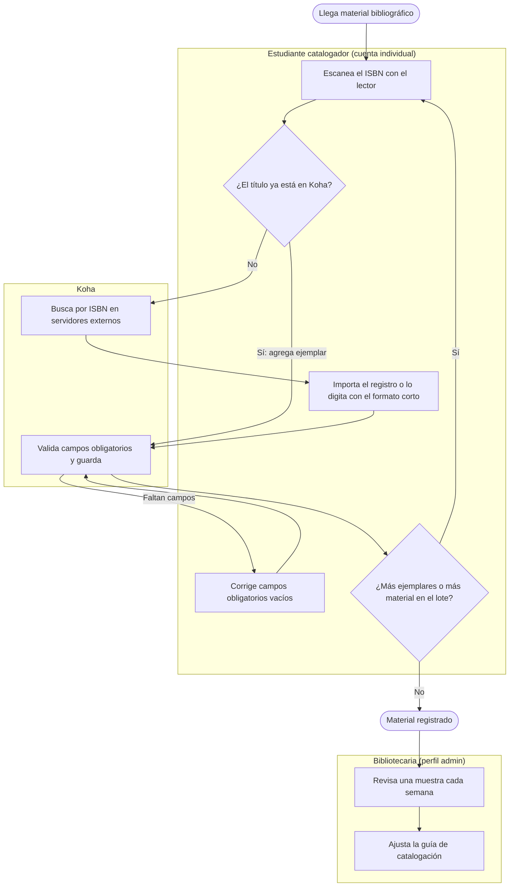

# Mejora de Arquitectura (TO-BE) — Identificación y Priorización de Mejoras

## Cliente
Biblioteca Pública Municipal de Cogua - Rubiel Valencia Cossio

## Integrantes del equipo (Equipo ARQUITECH)
- Jorge Alarcón (Jorgealis)
- Julián Aguirre (JulianAguirreUnisabana)
- Brayan Presiga (Brayan-137)

---

## 1. Diagnóstico inicial

- **Mayor fricción:** la catalogación manual en Koha (BPMN del Taller 1). Por cada título, una sola persona busca en servidores externos, importa o digita, corrige campos obligatorios y guarda. Con más de 8.000 ejemplares por registrar (ficha), Koha tiene cerca del 10 % de la colección y el resto se consulta en Excel (Taller 6, ítem 15). La segunda fricción es el doble registro de usuarios en Koha y Llave del Saber (Talleres 3 y 4).
- **Problemas recurrentes del cliente (ficha y entrevistas):** alimentar Koha mientras se usa Llave del Saber en paralelo, falta de personal, recursos limitados o con demora, y la limitación de la bibliotecaria para sostener tareas repetitivas durante periodos largos.
- **Vulnerabilidades y riesgos:** archivos en una sola copia en el PC (Taller 4, alta); cuentas de Koha con permisos de edición compartidas con los estudiantes, sin trazabilidad y con acceso a datos de menores (Taller 5, T3 y T4; Taller 6, ítems 9, 11 y 13); credencial única de Llave del Saber (Taller 5, T1); formulario en cuenta no institucional y discapacidad obligatoria (Taller 6, ítems 3, 4 y 8); sin plan cuando falla internet (Taller 5, T5).

| ID | Brecha | Origen |
|---|---|---|
| G1 | Catalogación manual título por título, a cargo de una sola persona | T1, T3, T6 |
| G2 | Archivos en una sola copia en el PC, sin respaldo | T4 |
| G3 | Cuentas de Koha compartidas, con permisos de edición y acceso a datos de menores | T5, T6 |
| G4 | Formulario en cuenta no institucional, discapacidad obligatoria, menores sin validación | T6 |
| G5 | Doble registro de usuarios en Koha y Llave del Saber | T3, T4, T5 |
| G6 | Credencial única de Llave del Saber, sin rotación ni MFA | T5 |
| G7 | Sin continuidad cuando falla internet | T4, T5 |
| G8 | Respaldos, cifrado y cumplimiento de terceros sin evidencia | T4, T5, T6 |

**Resumen (foto del AS-IS).** La biblioteca opera con una bibliotecaria, dos estudiantes de servicio social y tres herramientas fragmentadas (Koha, Llave del Saber y Excel). Su cuello de botella es la carga del catálogo: manual, dependiente de una persona y lento. El C2 del Taller 3 marca que el usuario no tiene canal digital, pero el Taller 4 y el Taller 6 muestran que el catálogo público y la app Nextbit ya existen y solo exhiben cerca del 10 % de la colección. El canal existe y falta contenido, por eso la catalogación es la brecha raíz. Alrededor de ella hay riesgos de seguridad y cumplimiento (cuentas compartidas, datos de menores) que la solución debe cerrar al mismo tiempo.

---

## 2. Propuesta de mejoras

### 2.1 Lluvia de ideas

| # | Idea de mejora | Tipo | Brecha |
|---|---|---|---|
| 1 | Lector de código de barras / ISBN y formato de catalogación corto en Koha | Proceso / Tecnología | G1 |
| 2 | Catalogación distribuida: estudiantes con cuentas individuales de permisos mínimos, compromiso de confidencialidad e inducción | Proceso / Seguridad | G1, G3 |
| 3 | App propia de carga por lotes hacia Koha (escanear ISBN, buscar por Z39.50/SRU, cargar por la API) | Tecnología | G1 |
| 4 | Catalogar primero el material más prestado o solicitado | Proceso | G1 |
| 5 | Respaldo 3-2-1 de los archivos del PC (disco externo y nube institucional) | Tecnología / Seguridad | G2 |
| 6 | Formulario en cuenta institucional, "Prefiero no responder" en discapacidad y validación presencial de menores | Cumplimiento | G4 |
| 7 | Enlace de respaldo 4G/5G y registro con fecha retroactiva cuando falla internet | Proceso / Tecnología | G7 |
| 8 | Solicitar a RNBP y Biteca rotación de credenciales y documentación de respaldos, cifrado y Ley 1581 | Gobierno | G6, G8 |
| 9 | Número de documento como identificador único y cruce periódico Koha / Llave del Saber | Proceso | G5 |

### 2.2 Priorización

| Solución priorizada | Esfuerzo | Impacto | Plazo | Justificación |
|---|---|---|---|---|
| **#2 Catalogación distribuida** | Medio | Alto | Mediano plazo | Única que cambia *quién* carga el trabajo y cierra a la vez las brechas de cuentas compartidas y de acceso a datos de menores. La decide la matriz (2.3). |
| **#1 Catalogación asistida** | Bajo | Medio | Quick win | Reduce la digitación por título y complementa a la #2: los estudiantes también usan el lector. |
| **#5 Respaldo 3-2-1** | Bajo | Alto | Quick win | Riesgo de mayor severidad del Taller 4 (pérdida permanente) y el único que la biblioteca cierra sola. |

La idea #3 (carga por lotes) se modela como **Fase 2**: gusta al cliente, pero Koha no ofrece carga por lotes en esta instalación, así que exige construir una app propia y que Biteca habilite el acceso por API. Las ideas #4 y #6 a #9 pasan al backlog, trazadas a su brecha; varias dependen de terceros.

### 2.3 Decisión para G1 (matriz ponderada)
Se compararon **A)** catalogación asistida, **B)** catalogación distribuida con los 2 estudiantes y **C)** carga por lotes con app propia. Pesos (por validar con la bibliotecaria): carga 35 %, dependencia de terceros 25 %, costo 20 %, calidad y seguridad 20 %.

| Opción | Carga | Dependencia | Costo | Calidad y seguridad | **Total** |
|---|---|---|---|---|---|
| A · Asistida | 3 | 4 | 4 | 3 | **3,45** |
| B · Distribuida | 4 | 4 | 5 | 4 | **4,20** |
| C · Lotes con app | 5 | 2 | 3 | 2 | **3,25** |

**Decisión:** B como solución principal, A como quick win complementario y C como Fase 2. **Trade-off:** se sacrifica el control directo sobre la calidad de la catalogación, que queda en manos de personas rotativas, a cambio de repartir la carga y cerrar brechas de seguridad. B gana en los tres escenarios de pesos probados; C solo la superaría si la carga pesara más del 66,7 %. A y C quedan a 0,20 puntos (empate técnico). Detalle y registro de uso de IA en `matriz-decision-catalogacion.md`.

---

## 3. Visualización TO-BE

### 3.1 Proceso mejorado
El proceso del Taller 1 pasa de ser ejecutado por la bibliotecaria a serlo por estudiantes con cuenta propia; ella revisa una muestra.

**Fase 2:** la app de carga por lotes reemplaza "escanear, buscar e importar" por un lote. El estudiante escanea muchos ISBN, la app consulta Z39.50/SRU y carga los registros a Koha, y él solo atiende las excepciones (sin ISBN o sin coincidencia).

### 3.2 Cambios en aplicaciones, infraestructura y flujos de información
- **Aplicaciones** (`to-be-aplicaciones-final.drawio`, extiende el C2 del Taller 3): nuevo actor *Estudiante catalogador*; Koha con dos perfiles (bibliotecaria-admin y catalogador, sin acceso a datos de usuarios); *Formulario de inscripción* en cuenta institucional; y, en Fase 2, la *App de carga por lotes* con cuenta de servicio propia.
- **Tecnología** (`to-be-tecnologia-final.drawio`, extiende el mapa del Taller 4): lector de códigos y portal de Koha para el estudiante; respaldo 3-2-1 con el PC (copia 1), un disco externo (copia 2, otro medio) y la nube institucional (copia 3, fuera del sitio) [11][12]. Las zonas de Biteca, Llave del Saber y Z39.50 no cambian; la Fase 2 solo añade un acceso por API REST a Koha, por confirmar con Biteca [3].
- **Flujos nuevos:** estudiante → Koha (HTTPS, cuenta individual); app → Z39.50/SRU y app → Koha (Fase 2); PC → disco externo y nube.

### 3.3 Controles de seguridad integrados (Talleres 5 y 6)

| Amenaza o brecha | Control integrado | Componente |
|---|---|---|
| T3 Repudio; T6-ítem 9 | Cuentas individuales en Koha (trazabilidad por persona). En Llave del Saber, bitácora externa de sesiones (mitigación del T5). | Koha |
| T4 Divulgación (menores); T6-ítems 11, 13, 14 | Perfil catalogador sin permiso sobre usuarios ni reportes, compromiso de confidencialidad e inducción; reportes solo para la bibliotecaria [5][6]. | Perfil catalogador |
| T6 Elevación de privilegios | Permisos por módulo revisados en el servidor y cuentas de estudiantes deshabilitadas al terminar el servicio. | Koha |
| T1 Suplantación | No reutilizar la clave de Llave del Saber; la app (Fase 2) usa credencial propia con permiso solo para crear registros bibliográficos [10]. | App Fase 2 |
| Punto único de falla (Taller 4) | Respaldo 3-2-1 en nube institucional, sin datos personales de usuarios sin revisar la política de la Alcaldía [13]. | Almacenamiento |

---

## 4. Análisis de beneficios y riesgos

| Mejora | Beneficio de negocio | Beneficio tecnológico / seguridad | Riesgo, limitación o dependencia |
|---|---|---|---|
| **B · Catalogación distribuida** | Reparte el trabajo repetitivo y acelera el catálogo público (Ley 1379 [15]). | Trazabilidad por persona; menores protegidos con permisos mínimos (Ley 1581 [14]). | El perfil restringido debe funcionar en su instancia (por probar), rotación de estudiantes y calidad variable. Requiere guía, inducción y compromiso firmado. |
| **A · Catalogación asistida** | Menos digitación por título. | Menos errores de ISBN y de campos vacíos. | Compra del lector con recursos limitados o con demora; material sin ISBN; el formato corto quizá requiere permiso de Biteca. |
| **Respaldo 3-2-1** | Evita perder años de archivos de eventos y talleres. | Elimina el punto único de falla del PC. | Costo de la nube sin cuenta institucional con espacio; disciplina para mantener las copias. |
| **C · Carga por lotes (Fase 2)** | Cierra el catálogo mucho más rápido. | Menos intervención manual. | Biteca debe habilitar la API REST (versión desconocida) [3][4]; alguien debe construir y mantener la app; riesgo de duplicados. |

### 4.1 Capacidades de negocio y paquetes de trabajo
Madurez 1-5 (AS-IS → TO-BE; tabla completa en `matriz-brechas.xlsx`): Catalogar 2 → 4, Consultar el catálogo 2 → 3, Inscribir y gestionar usuarios 2 → 3, Proteger y respaldar 1 → 4, Controlar el acceso a los datos 2 → 4, Prestar material 3 → 3.

| Paquete de trabajo | Brechas | Capacidad que mejora | Tipo |
|---|---|---|---|
| WP1 · Respaldo de archivos | G2 | Proteger y respaldar | Quick win |
| WP2 · Catalogación asistida | G1 | Catalogar | Quick win |
| WP3 · Catalogación distribuida y acceso seguro | G1, G3, parte de G4 | Catalogar, Controlar el acceso | Mediano plazo (decide la matriz) |
| WP4 · Carga por lotes con app propia | G1 | Catalogar | Fase 2, condicionada a Biteca |
| WP5 · Cumplimiento, identidad y continuidad | G4 (resto), G5 a G8 | Inscribir y gestionar usuarios | Backlog; depende de RNBP y Biteca |

---

## Anexos
- `entrega/to-be-aplicaciones-final.drawio` y `entrega/to-be-tecnologia-final.drawio`
- `entrega/matriz-brechas.xlsx` (brechas, decisión ponderada con fórmulas, capacidades y supuestos)
- `entrega/matriz-decision-catalogacion.md` y `entrega/referencias.md` (la numeración [n] corresponde a ese archivo)

**Formato de entrega:** PDF de máximo 6 páginas + anexos, con nombre `ARQUITECH_Mejora_Arquitectura.pdf`.

---

_Este documento hace parte de la entrega del Taller 7 (Opportunities & Solutions) del curso AREM - Universidad de La Sabana._
